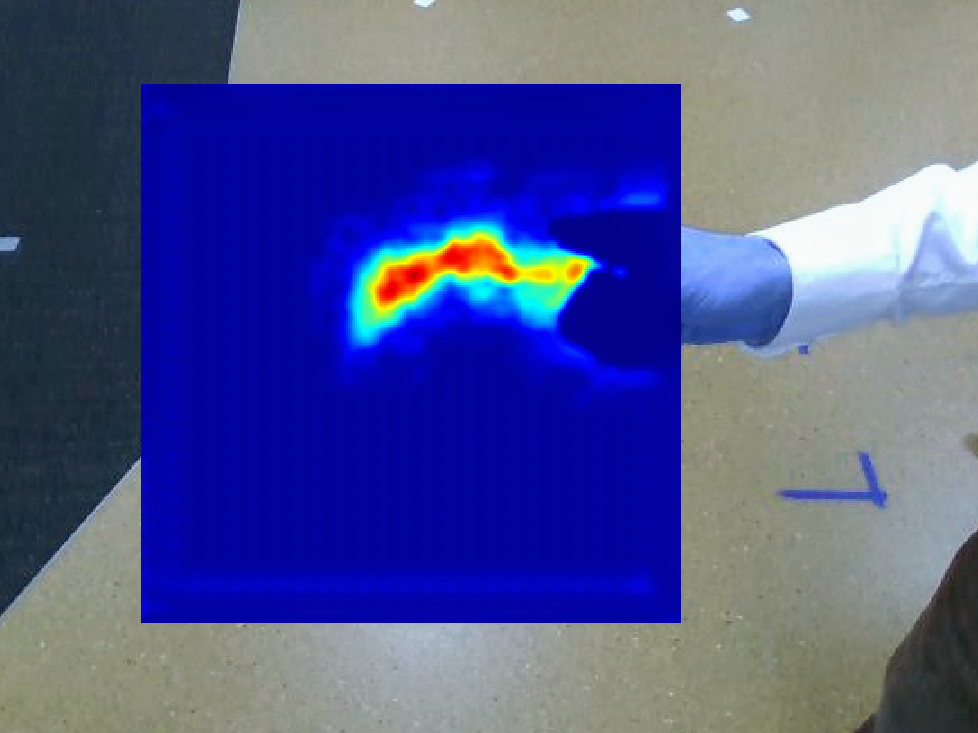

# GGCNN ROS package with human body parts filtering #

This is an extended ROS implementation of the [ggcnn network](https://github.com/dougsm/ggcnn). The node outputs the the best picking location based on an object's depth image and the input of the three packes [Bodyparts](https://github.com/patrosAT/bodyparts_ros), [Egohands](https://github.com/patrosAT/egohands_ros) and [Yolov3](https://github.com/leggedrobotics/darknet_ros). Extensive pre- and post-processing prevents the picking of human body parts.

This node is part of a larger project with the objective to enable object-independent human-to-robot handovers using robotic vision. The code for this project can be found [here](https://github.com/patrosAT/human_robot_handover_ros).

**Input**
* **Depth image:** [sensor_msgs/Image](http://docs.ros.org/melodic/api/sensor_msgs/html/msg/Image.html)
* **Bodyparts:** [sensor_msgs/CompressedImage](http://docs.ros.org/melodic/api/sensor_msgs/html/msg/CompressedImage.html)
* **Egohands:** [sensor_msgs/CompressedImage](http://docs.ros.org/melodic/api/sensor_msgs/html/msg/CompressedImage.html)
* **Yolo:** [sensor_msgs/Image](http://docs.ros.org/melodic/api/sensor_msgs/html/msg/Image.html)

**Output**
* **Best picking point:** [GraspPrediction](/msg/GraspPrediction.msg), transformed into the robot's base frame.

#### Example of a banana from a lateral perspective: ####

This heat map shows the success probability for each pixel (0%: dark blue, 100%: dark red). Pixels belonging to the human are set to 0%, pixels close to the hand are degraded.

## Getting Started ##

### Dependencies ###

The models have been tested with Python 2.7.
The transformations are specific to the [Franka Emika robot arm](https://frankaemika.github.io/).

### Hardware ###

* Depth camera *(for this project an [realsense D435](https://www.intelrealsense.com/depth-camera-d435/) was used)*
* GPU >= 4 GB
 
### Software ###

**ATTENTION: This package requires the [ROS](https://www.ros.org/) operating system!**

* Python 2.x: see [requirements.txt](requirements.txt)

### Ros 3rd party packages ###

* [Bodyparts_ros](https://github.com/patrosAT/bodyparts_ros.git)
* [Egohands_ros](https://github.com/patrosAT/egohands_ros.git)
* [Darknet_ros](https://github.com/leggedrobotics/darknet_ros)

**Note:** To enable real-time processing it might be necessary to distribute these packages across several computers. We recommend using [sensor_msgs/CompressedImage](http://docs.ros.org/melodic/api/sensor_msgs/html/msg/CompressedImage.html)s to keep the network usage on a reasonable level.

### Launch ###

Before launching the package, make sure that the camera and the 3rd party ros packages are up and running. 

The ros package contains a launch file:
* **[Publisher](launch/ggcnn_humanseg_publisher.launch):** Publishes a mask every time a new image is published by the camera.

**Input**
* **Depth image:** [sensor_msgs/Image](http://docs.ros.org/melodic/api/sensor_msgs/html/msg/Image.html)
* **Bodyparts:** [sensor_msgs/CompressedImage](http://docs.ros.org/melodic/api/sensor_msgs/html/msg/CompressedImage.html)
* **Egohands:** [sensor_msgs/CompressedImage](http://docs.ros.org/melodic/api/sensor_msgs/html/msg/CompressedImage.html)
* **Yolo:** [sensor_msgs/Image](http://docs.ros.org/melodic/api/sensor_msgs/html/msg/Image.html)

**Output**
* **Best picking point:** [GraspPrediction](/msg/GraspPrediction.msg), transformed into the robot's base frame.

## Configuration ##

The initial setup can be changed by adapting the [ggcnn_humanseg.yaml](cfg/ggcnn_humanseg.yaml) file:

**Camera info:** The following settings adjusted for using a [Franka Emika](https://frankaemika.github.io/) robot arm with a end-effector mounted [realsense D435](https://www.intelrealsense.com/depth-camera-d435/).

* **info:** Rostopic the publisher is subscribing to (camera info). 
* **camera_frame:** The camera frame.
* **robot_base_frame:** The robot base frame.
* **fov:** The camera's field of view.

**Camera:**
* **image:** Rostopic the publisher is subscribing to (rgb image).
* **depth:** Rostopic the publisher is subscribing to (depth image).

**Subscription:**
* **bodyparts:** Rostopic the node is subcribing to (bodyparts).
* **egohands:** Rostopic the node is subcribing to (egohands).
* **darknet:** Rostopic the node is subcribing to (yolo v3).

**Interface:**
* **topic:** Rostopic the publisher node is publishing to.

**Ggcnn:** GGCNN specific parameter. See [paper](https://arxiv.org/abs/1804.05172) for more inforamtion.
* **crop_size:** *Change with caution!*.
* **crop_offset:** *Change with caution!*.
* **out_size:** *Change with caution!*.

**Robot:**
* **dist_ignore:** Field of range in meter [m]. Objects behind this distance are inored
* **gripper_width:** Gripper height in meter [m].

**Visualization:** The visualization node published the heat map showing the success probability for each pixel (0%: dark blue, 100%: dark red). Please be aware that turing on the visualization increases computing time and network utilization substantially (approx. factor x20).

* **topic:** Topic the node is publishing to.
* **activated:** Turn on/off visualization: *use keywords "on" or "off"*.

## Acknowledgments ##

The ROS node is powered by the ggcnn of [dougsm](https://github.com/dougsm). For more information, please refer to the following [paper](https://arxiv.org/abs/1804.05172) or [github repository](https://github.com/dougsm/ggcnn).

## License ##

The project is licensed under the BSD 4-Clause License.
